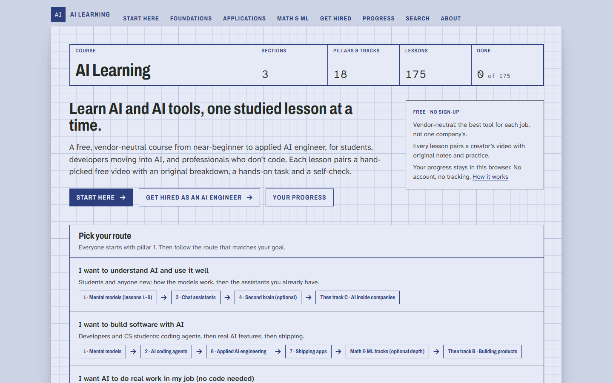
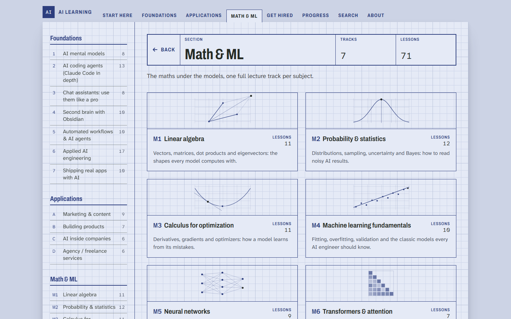
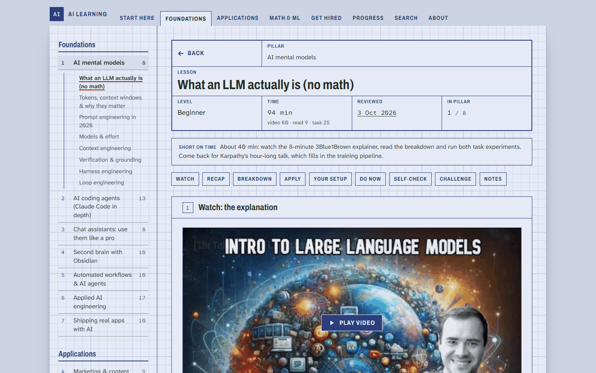
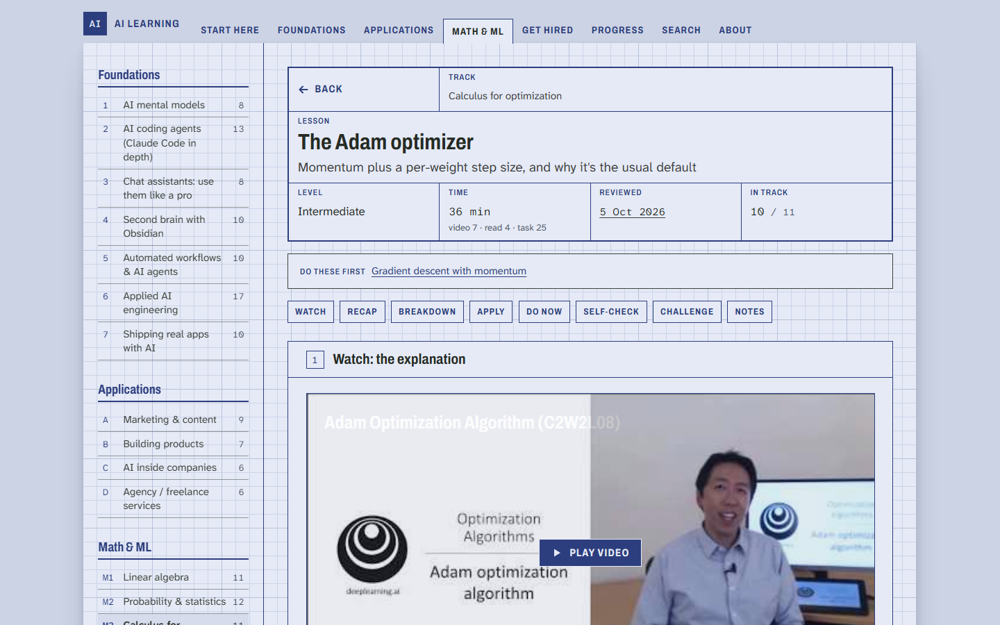
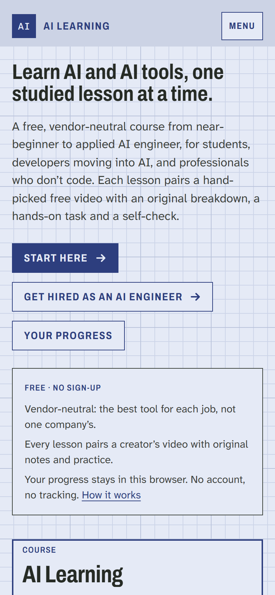

# Seif Younes

I build websites and mobile apps with Next.js and Flutter by orchestrating AI coding agents. I plan each feature, run
the agents in parallel, then review their changes and test them on real devices.
Mechatronics Engineering student at Alexandria University (graduating 2028) with a flexible schedule, based in
Alexandria, Egypt and available for full-time remote work.

Email: seifyounes222@gmail.com · [LinkedIn](https://www.linkedin.com/in/seif-younes12/)

## PureChem, an agrochemicals company website (live)

Live at [purechem-website.vercel.app](https://purechem-website.vercel.app/). Shown with the client's permission; some
details in the screenshots are blurred.

A Next.js 15 product catalogue with 76 prerendered pages and quote and contact forms. I did the design, the build
(directing AI coding agents), and the content and media.

- First version handed over in 3 days. PureChem rehired me for new pages.
- The client says the site brings in 100+ quote requests a month.

  
  

## AI Learning, a free AI course website (live)

A free course website that takes you from near-beginner to applied AI engineer, with no sign-up.

- Live: [ai-learning-website-eta.vercel.app](https://ai-learning-website-eta.vercel.app/)
- Source: [seifyounes/ai-learning-website-public-edition](https://github.com/seifyounes/ai-learning-website-public-edition)
  (code MIT, lesson text CC BY-NC 4.0)

**What's inside**

- 175 lessons in 18 topic areas, in three sections: Foundations, Applications, and Math & ML.
- Math & ML has seven tracks, from linear algebra to transformers and evaluation. Each track follows one full lecture
  series, with one lesson per lecture.
- Each lesson is built around one vetted free video, with notes, a short recap you test yourself on, a hands-on task
  and a self-check. 115 lessons also have a scored quiz.
- Three routes by goal: for students, for developers, and for people who don't code.
- Search that copes with typos. Progress, notes and quiz scores stay in your browser: no accounts, cookies or
  analytics.

**How I built it**

I planned the course and ran several AI coding agents in parallel to build the site and draft the lessons. I set the
rules for choosing the videos, and one agent worked as a reviewer, acting as an applied-AI expert, and rated the videos
against my criteria. Every push has to pass type checks, lint, a lesson-format check and a production build, and a
weekly job re-checks every video and link.

**Stack:** Next.js 15, React, TypeScript and Tailwind CSS, fully static. I deployed it to Vercel myself.

<table>
  <tr>
    <td></td>
    <td></td>
  </tr>
  <tr>
    <td></td>
    <td></td>
  </tr>
</table>

## Elite, a habit app for iOS and Android (in private testing)

Flutter, Riverpod, Supabase. In private testing with a small group; not in the app stores. The source is private; these are
screens from a test build with test data.

  
  
  
  

- Check-ins made offline are queued and sent exactly once when the phone reconnects.
- Home-screen widgets on iOS and Android tick off a habit without opening the app.
- The agents write the tests; I decide what each one checks and review them. The 3,400+ unit and widget tests confirm
  the score and streak math matches the database and no personal data reaches the logs.

## Lofty, an idea tracker (live)

Ideas float as physics-driven balloons (matter-js), sized by scope and ranked by priority. Next.js 14 and TypeScript;
ideas are saved in the browser.

- Demo with sample ideas: https://lofty-two.vercel.app/demo
- Source: [seifyounes/lofty](https://github.com/seifyounes/lofty)

## AI news agent

An AI agent that scores AI news on 5 criteria and keeps only stories rated 8/10 or higher. It has written 60+
digests since July 2026.

- Source: [seifyounes/ai-news-agent](https://github.com/seifyounes/ai-news-agent)
