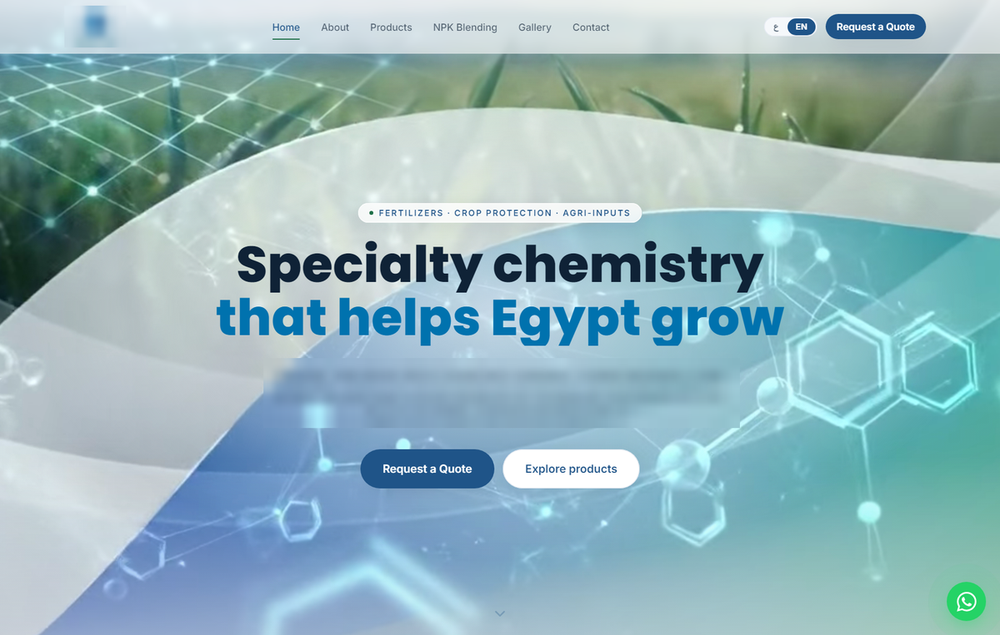
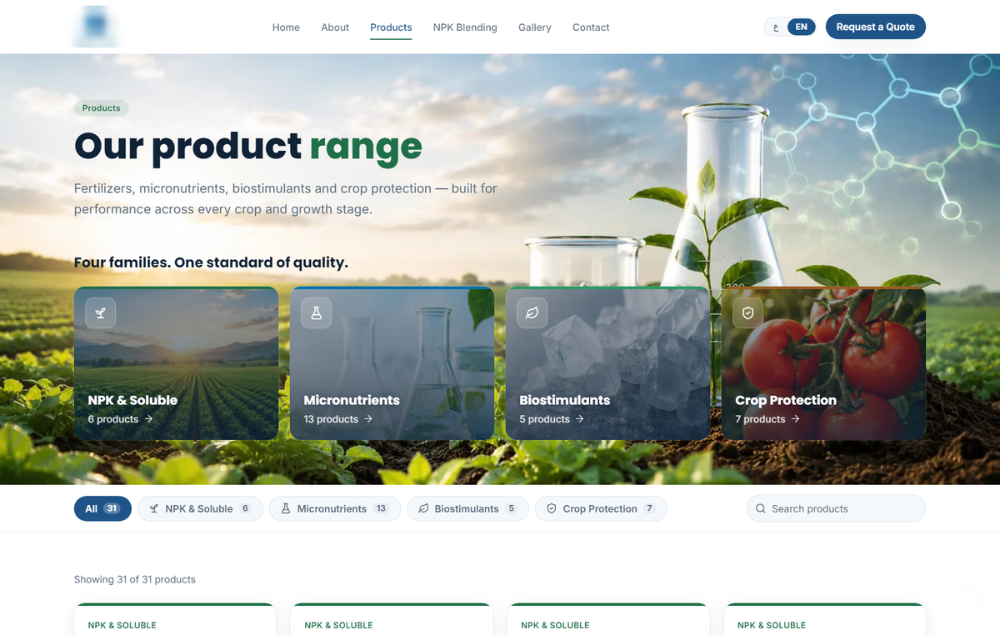
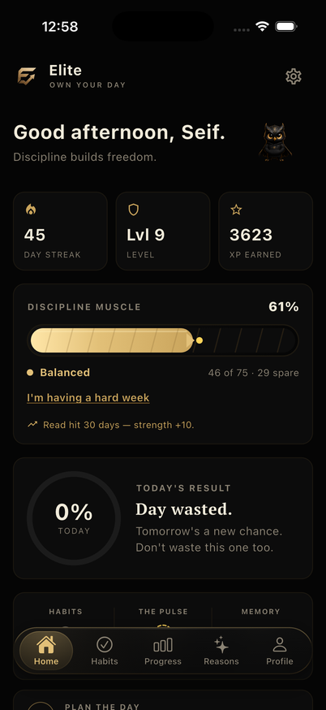
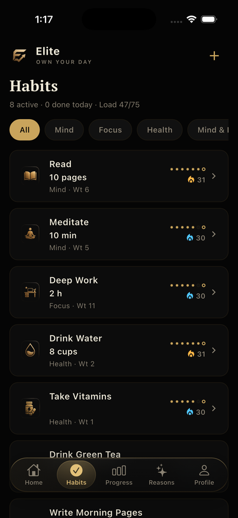
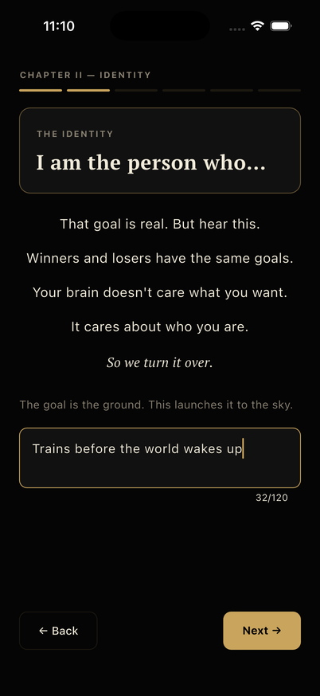
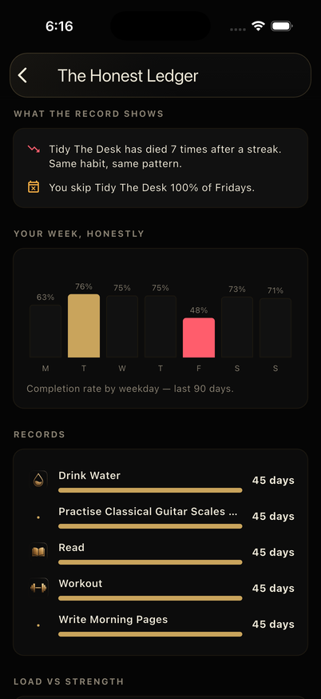

# Seif Younes

Full-stack developer (Next.js, Flutter, Supabase) in Alexandria, Egypt. I design each feature, run parallel AI coding
agents (Claude Code, Codex) to build it, review their diffs and verify the work with automated tests. Final-year
Mechatronics Engineering student, available for full-time remote work.

Email: seifyounes222@gmail.com

## Client work: agrochemicals company (live)

Shown with the client's permission; name and logo are blurred. A bilingual Arabic/English (RTL/LTR) Next.js 15 product
catalogue: 76 prerendered pages, quote and contact API routes with validation, spam protection and rate limits.

- First version handed over in 3 days; the client came back for paid follow-up work.
- Desktop Lighthouse performance 98.
- The site brings in 100+ quote requests a month.

  
  

## Lofty, an idea tracker (live)

Ideas float as physics-driven balloons (matter-js), sized by scope and ranked by priority. Next.js 14 and TypeScript.

- Demo with sample ideas: https://lofty-two.vercel.app/demo
- Source: [seifyounes/lofty](https://github.com/seifyounes/lofty)

## Elite, a habit app for iOS and Android (in private testing)

Flutter, Riverpod, Supabase. The source is private; these are screens from the test build with test data.

  
  
  
  

- Offline check-ins sync without duplicate writes on reconnect; native home-screen widgets on iOS and Android.
- Every feature must pass 3,400+ unit and UI tests, including privacy tests that fail if personal data reaches
  analytics or logs.
